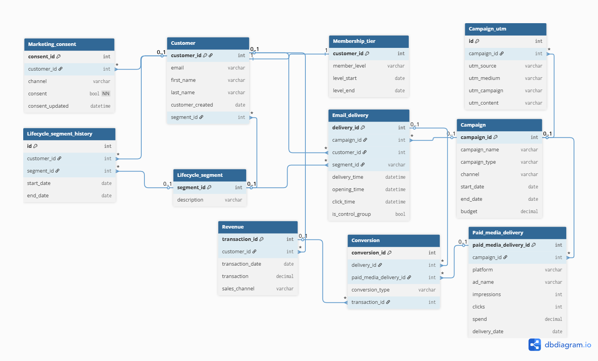

# CRM Marketing Database Model

This database model was designed as part of ICT engineering studies, combining academic database design principles with hands-on CRM and marketing automation experience. The model reflects real-world marketing analytics needs. The tables are designed to answer questions such as:

1. Campaign performance
- What were the open and click rates in email delivery?
- How many converted, and to what type of conversion?
- Does tactical or awareness perform better in different segments?
- Which channel delivers the best results?

2. Sales measurement
- What was the incremental lift generated by the campaign based on control group?
- Which sales channel is the most productive?
- What is campaign ROI compared to budget?
- Do customers who opted out from marketing buy organically during the campaign?

3. Segment activation
- Which lifecycle segment does the campaign activate most?
- How many passive customers were converted to active?
- Which lifecycle segment has highest conversion rate?
- How long does it take to progress from one lifecycle segment to another?

4. Customer value
- How does membership tier correlate with purchases and campaign responsiveness?
- How much additional revenue does marketing consent deliver?
- Which segment generates the most long-term value?

5. GDPR reporting requirements
- Who has valid consent for each channel?
- When was consent given or cancelled?
- What's the share of customers who can be reached per marketing channel?

## File structure

Source: `customer-data.sql`

Tables:

- `Customer`
- `Marketing_consent`
- `Membership_tier`
- `Lifecycle_segment`
- `Lifecycle_segment_history`
- `Campaign`
- `Campaign_utm`
- `Email_delivery`
- `Paid_Media_Delivery`
- `Conversion`
- `Revenue`

## Table attributes

### Customer
- `customer_id` INT GENERATED BY DEFAULT AS IDENTITY PRIMARY KEY
- `email` varchar
- `first_name` varchar
- `last_name` varchar
- `customer_created` date
- `segment_id` int

### Marketing_consent
- `consent_id` int PRIMARY KEY
- `customer_id` int
- `channel` varchar
- `consent` bool NOT NULL
- `consent_updated` datetime

### Membership_tier
- `customer_id` int PRIMARY KEY
- `member_level` varchar
- `level_start` date
- `level_end` date

### Lifecycle_segment
- `segment_id` int PRIMARY KEY
- `description` varchar

### Lifecycle_segment_history
- `id` INT GENERATED BY DEFAULT AS IDENTITY PRIMARY KEY
- `customer_id` int
- `segment_id` int
- `start_date` date
- `end_date` date

### Campaign
- `campaign_id` INT GENERATED BY DEFAULT AS IDENTITY PRIMARY KEY
- `campaign_name` varchar
- `campaign_type` varchar
- `channel` varchar
- `start_date` date
- `end_date` date
- `has_coupon` bool
- `budget` decimal

### Campaign_utm
- `id` INT GENERATED BY DEFAULT AS IDENTITY PRIMARY KEY
- `campaign_id` int
- `utm_source` varchar
- `utm_medium` varchar
- `utm_campaign` varchar
- `utm_content` varchar

### Email_delivery
- `delivery_id` INT GENERATED BY DEFAULT AS IDENTITY PRIMARY KEY
- `campaign_id` int
- `customer_id` int
- `segment_id` varchar
- `message_number` int
- `delivery_time` datetime
- `opening_time` datetime
- `click_time` datetime
- `is_control_group` bool

### Paid_Media_Delivery
- `delivery_id` INT GENERATED BY DEFAULT AS IDENTITY PRIMARY KEY
- `campaign_id` int
- `customer_id` int
- `channel` varchar
- `impressions` int
- `clicks` int
- `spend` decimal
- `delivery_date` date

### Conversion
- `conversion_id` INT GENERATED BY DEFAULT AS IDENTITY PRIMARY KEY
- `delivery_id` int
- `conversion_type` varchar
- `transaction_id` int
- `coupon_code_used` bool

### Revenue
- `transaction_id` INT GENERATED BY DEFAULT AS IDENTITY PRIMARY KEY
- `customer_id` int
- `transaction_date` date
- `transaction` decimal
- `sales_channel` varchar

## Relations

- `Marketing_consent.customer_id` -> `Customer.customer_id`
- `Customer.customer_id` -> `Membership_tier.customer_id`
- `Revenue.customer_id` -> `Customer.customer_id`
- `Campaign_utm.campaign_id` -> `Campaign.campaign_id`
- `Email_delivery.campaign_id` -> `Campaign.campaign_id`
- `Email_delivery.customer_id` -> `Customer.customer_id`
- `Conversion.delivery_id` -> `Email_delivery.delivery_id`
- `Customer.segment_id` -> `Lifecycle_segment.segment_id`
- `Lifecycle_segment_history.customer_id` -> `Customer.customer_id`
- `Conversion.transaction_id` -> `Revenue.transaction_id`
- `Email_delivery.segment_id` -> `Lifecycle_segment.segment_id`
- `Lifecycle_segment_history.segment_id` -> `Lifecycle_segment.segment_id`
- `Paid_Media_Delivery.campaign_id` -> `Campaign.campaign_id`
- `Paid_Media_Delivery.customer_id` -> `Customer.customer_id`

## Setup

1. Execute the SQL script in your database: `customer-data.sql`
2. Ensure your database supports `IDENTITY` and `DEFERRABLE` key constraints. Tested on PostgreSQL. MySQL users may need to adjust IDENTITY syntax.

